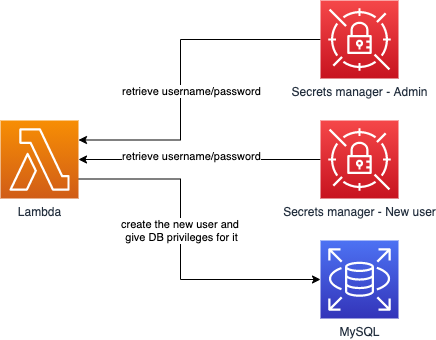
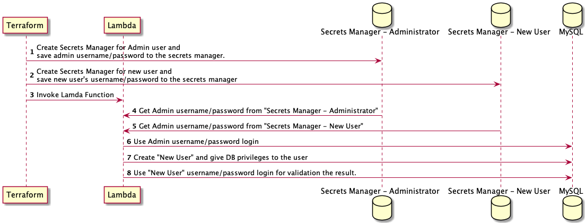

# terraform-mysql-user-creation
Auto create MySQL user


## Terraform versions
* Terraform >= 0.13
* AWS provider >= 3.20 


## Overview
* Architecture diagram


* Sequence diagram 



1. The module must execute after RDS create successfully 
2. If the user was created in the past, the lambda will detect and skip the creation process.


## Usage
```hcl
resource "aws_security_group" "lambda" {
  vpc_id = var.vpc_id

  tags   = merge(var.tags, {
    Name        = "${var.project}-${terraform.workspace}-${var.name}-lambda"
    Environment = "${var.project}-${terraform.workspace}"
  })
}

resource "aws_security_group_rule" "to_rds" {
  security_group_id        = aws_security_group.lambda.id
  type                     = "egress"
  protocol                 = "tcp"
  from_port                = 3306
  to_port                  = 3306
  source_security_group_id = aws_security_group.rds.id
}

resource "aws_security_group_rule" "to_ssm" {
  security_group_id        = aws_security_group.lambda.id
  type                     = "egress"
  protocol                 = "tcp"
  from_port                = 443
  to_port                  = 443
  cidr_blocks              = ["0.0.0.0/0"]
}

module "rds_account_creation" {
  source              = "git::https://github.com/KKStream/terraform-aws-mysql-user-creation"
  project             = var.project
  name                = var.name
  db_endpoint         = var.rds.internal_domain_name
  db_port             = local.rds_port
  db_name             = local.rds_db_name

  db_master_username  = local.rds_master_username
  db_master_password  = local.rds_master_password
  db_new_user_name    = local.rds_airflow_username

  vpc_id              = var.vpc_id
  subnet_ids          = var.rds_subnet_ids
  security_group_ids  = [aws_security_group.lambda.id]
  package_bucket_name = "package-bucket-name"

  depends_on = [aws_security_group.lambda, aws_rds_cluster.rds]
}
```

## Inputs

| Name | Description | Type | Default | Required |
|------|-------------|------|---------|:--------:|
| project | project for current app | `string` | no | yes |
| name | name for current app | `string` | no | yes |
| vpc_id | The VPC ID for the ECS Cluster | `string` | no | yes |
| subnet_ids | Subnet IDs for Lambda | `list(string)` | no | yes |
| security_group_ids | Security groups for Lambda | `list(string)` | no | yes |
| db_endpoint | Database endpoint | `string` | no | yes |
| db_name | Database name | `string` | no | yes |
| db_port | The port for the database | `number` | `5432` | no |
| db_master_username | The user name of the database master | `string` | no | yes |
| db_master_password | The password of the database master | `string` | no | yes |
| db_new_user_name | The user of the database, this user can login | `string` | no | yes |
| package_bucket_name | The s3 package bucket for storing lambda package | `string` | no | yes |
| invocation_failure_target_arn | SNS arn for deployment failure. Use for database user creation failure | `string` | `""` | no |
| tags | A map of tags to add to ECS Cluster, default use `Name` & `Environment` tags. | `map(string)` | `{}` | no |

## Outputs

| Name | Description |
|------|-------------|
| user_sm_arn | where the username and password of the database user stored in |
| master_sm_arn | where the username and password of the database master stored in |